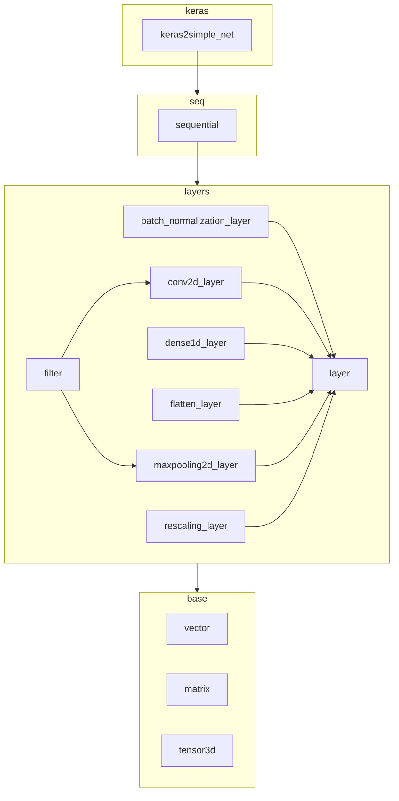

# simple_net

Implements convolutional networks using pure Python primitives, 
offering a lightweight solution for the predict phase.
It supports importing certain pre-trained Keras convolutional 
models into its native format, enabling the execution of the predict step for recognition tasks.
This functionality is particularly useful on systems where only a basic Python installation is available.

## Why?
`simple_net` was created to be used in a ([plugin](https://ankiweb.net/shared/info/67466478]) for the popular
Anki flashcard program. The idea was to add a Kanji recognition feature to the plugin. Anki plugins
are written in Python and only provides a basic Python installation. Using or adding
libraries like `numpy` or `keras` cannot easily be done. So the idea was to train a model in
Keras for Kanji recognition and then transfer it into `simple_net` format, `pickle` it and then use it in the plugin.
It also helped the author to familiarize himself better with the internals of the different Keras layers working,
and he finally seemd to graps all concepts of convolutional layers, now that he had
to code them on his own :-) 
Unfortunately, the actual integration into MangAnki has still to be done...

## How?
`simple_net` implements:
- base abstractions for tensors in form of `Vector`, `Matrix` and `Tensor3D` Python classes
- Counterparts for many important Keras layers (but not with all their possible config options), 
  e.g. for `Dense`, `Conv2D`, `Flatten`, `MaxPooling2D`, `BatchNormalization`
- Abstraction for sequential execution of layers (`Sequential`)
- Transformation of keras models to `simple_net` models (in `keras2simple_net`)

It uses Python's ```array``` internally. No parallelization (although some experiments with `multiprocessing` can
be found in `conv2d_layer.py`). So expect long waiting times for larger models.


## Tests
Tests are written with `pytest` and require a Keras installation, since they also check the transformation part.
Most of the tests create a Keras layer `K`, create a prediction `K(I)` for a random
input `R`, transform `K` into a `simple_net` layer `L` and test whether `K(I) = L(I)`.
There is also a test that uses a simple Keras net for recognizing single japanese Kanji characters.